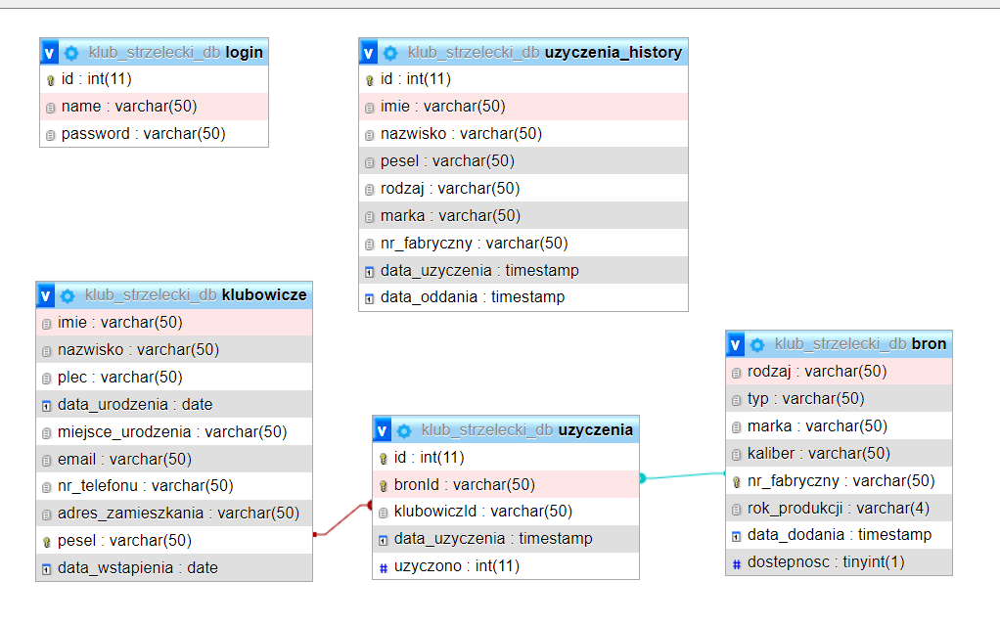
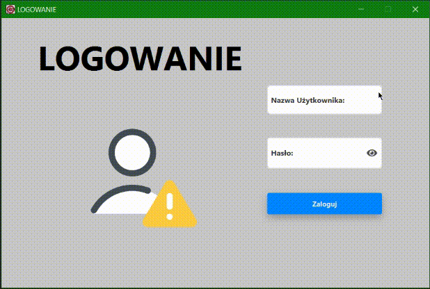
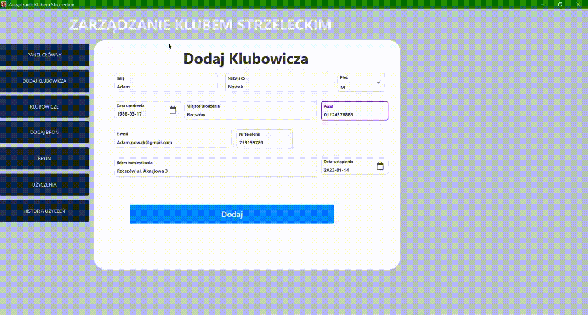
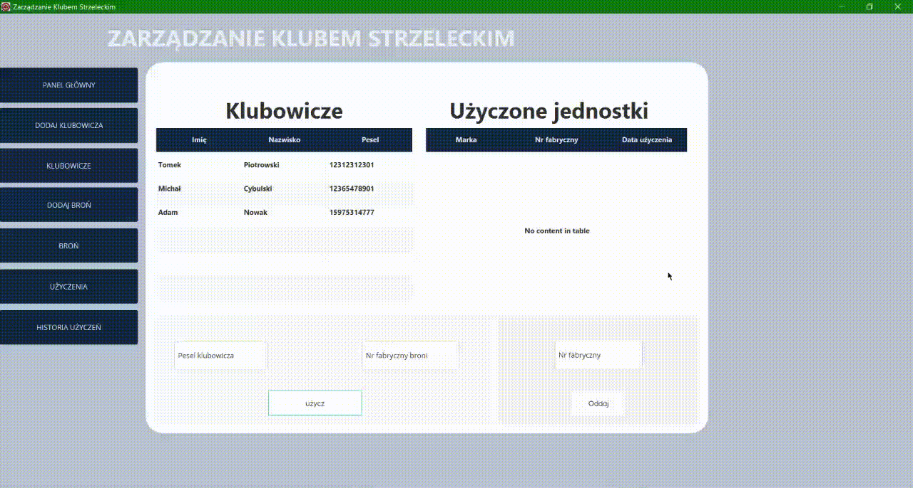

# System Zarządzania Klubem Strzeleckim

## Spis Treści

1. [Wprowadzenie](#wprowadzenie)
   - [Wstęp](#wstęp)
   - [Cel Aplikacji i Opis Ogólny](#cel-aplikacji-i-opis-ogólny)
   - [Baza Danych - Diagram ERD](#baza-danych---diagram-erd)
2. [Instalacja](#instalacja)
   - [Konfiguracja Systemu i Bazy Danych](#1-konfiguracja-systemu-i-bazy-danych)
   - [Uruchamianie Aplikacji](#2-uruchamianie-aplikacji)
3. [Interfejs Użytkownika](#interfejs-użytkownika)
   - [Opis Ogólny](#1-opis-ogólny)
4. [Funkcjonalność](#funkcjonalność)
   - [Funkcje](#1-funkcje)
5. [Przewodnik Krok po Kroku](#przewodnik-krok-po-kroku)
   - [Logowanie](#1-logowanie)
   - [Funkcjonalność Panelu Głównego](#2-funkcjonalność-panelu-głównego)
   - [Wyświetlanie Klubowiczów](#3-wyświetlanie-klubowiczów)
   - [Użyczanie Broni](#4-użyczanie-broni)
   - [Export Historii Użyczeń do Excela](#5-export-historii-użyczeń-do-excela)
6. [Bezpieczeństwo Aplikacji](#bezpieczeństwo-aplikacji)

## Wprowadzenie

### Wstęp

Wszystko dąży do cyfryzacji, myśliwi zostali zmuszeni do prowadzenia „Elektronicznej Ewidencji Polowań”. W związku z tym, inne grupy strzelców także będą musiały korzystać z podobnego systemu w przyszłości. Moja aplikacja umożliwia w łatwy i przyjazny sposób zarządzanie takim klubem.

### Cel Aplikacji i Opis Ogólny

**Cel Aplikacji:**
Aplikacja ma na celu usprawnienie zarządzania klubem strzeleckim poprzez udostępnienie funkcji CRUD dla tabel związanych z członkami klubu i bronią klubową.

**Opis Ogólny:**
Aplikacja napisana jest w języku Java i łączy się z relacyjną bazą danych. Udostępnia funkcje CRUD, a interfejs graficzny został stworzony przy użyciu JavaFX.

### Baza Danych - Diagram ERD

## Instalacja

### 1. Konfiguracja Systemu i Bazy Danych

- Upewnij się, że masz zainstalowane JDK w wersji 17. Aplikacja została napisana przy użyciu Java 17 z dystrybutorem "Amazon Corretto". [Pobierz JDK 17](https://docs.aws.amazon.com/corretto/latest/corretto-17-ug/downloads-list.html)
- Baza Danych: MySQL w wersji 15.1 Distrib 10.4.21-MariaDB oraz aplikacja XAMPP. [Pobierz XAMPP](https://www.apachefriends.org/download.html)

- Uruchamiamy XAMPP Apacha i MySql, Następnie wchodzimy na stronę http://localhost/phpmyadmin/ tworzymy bazę o nazwie "klub_strzelecki". Importujemy bazę danych z pliku sql

### 2. Uruchamianie Aplikacji

Zlokalizuj i uruchom aplikację o nazwie `Klub.exe`. Zaloguj się danymi domyślnymi (Nazwa użytkownika: Mike, Hasło: 123).

## Interfejs Użytkownika

### 1. Opis Ogólny

Aplikacja jest zoptymalizowana dla rozdzielczości 1920x1080 i składa się z dwóch obszarów: przycisków nawigacyjnych po lewej i odpowiadających okienek po prawej.

## Funkcjonalność

### 1. Funkcje

- Wyświetlanie wykresów dodanych członków, dostępnej i wypożyczonej broni oraz aktualnej liczby członków klubu.
- Operacje CRUD dla członków klubu i broni klubowej.
- Zarządzanie wypożyczeniami broni z historią i eksportem do Excela.

## Przewodnik Krok po Kroku

### 1. Logowanie

### 2. Funkcjonalność Panelu Głównego:

Panel główny posiada informacje o aktualnej liczbie klubowiczy, dostępnej i użyczonej broni.

### 3. wyświetlanie klubowiczy

Tabela z klubowiczami ma możliwość filtrowania danych, należy wybrać, po jakiej pozycji mamy filtrować tabelę (np.: nazwisko) i wpisać w pole „wyszukaj” a dane automatycznie się zaktualizują.
Tabela posiada paginację stron, która jest dostosowywana wraz z filtrowaniem danych.
Kolejną funkcjonalnością jest możliwość edycji danych, usuwania ich, odświeżania oraz możliwość użyczania broni. Wszystkie funkcję pojawią się w momencie, kiedy klikniemy prawym przyciskiem myszy na wybranego przez nas klubowicza.

### 4. Użyczanie broni

Aby użyczyć broń klubowiczowi należy go wybrać w tabeli, kliknąć prawym przyciskiem myszy i wybrać opcję "użycz", wyświetli się okno z użyczaniem i użytkownik zostanie przeniesiony do tabeli z bronią. Następnie należy wybrać broń, którą chcemy użyczyć, kliknąć prawym przyciskiem myszki skopiować "numer seryjny broni" i wstawić go do pola (można też wpisać ręcznie). Na samym końcu należy kliknąć przycisk "użycz" użytkownik zostanie poinformowany czy użyczanie powiodło się, czy nie.

### 5. Export historii użyczeń do excela

Historia użyczeń posiada filtrowanie danych, dodatkowo jest możliwość zapisania tych danych do pliku xlsx.

## Bezpieczeństwo Aplikacji

- Obowiązkowe ograniczenia NOT NULL dla istotnych pól tabel.
- Walidacja pól w celu zapobieżenia nieprawidłowym danym.
- Aplikacja wymaga poprawnej wersji Javy do uruchomienia.
